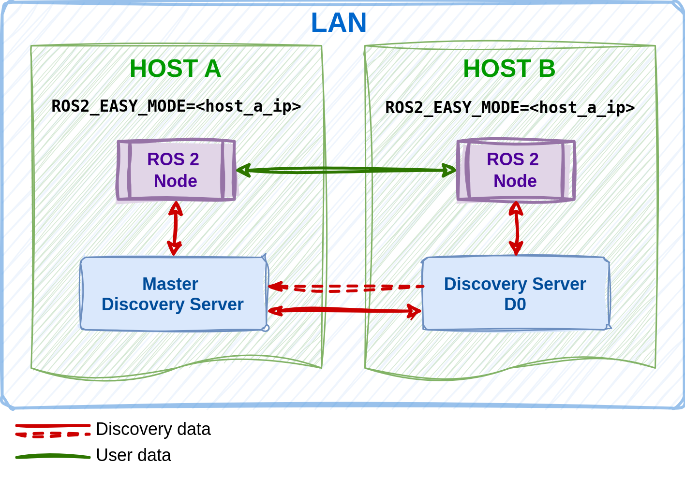
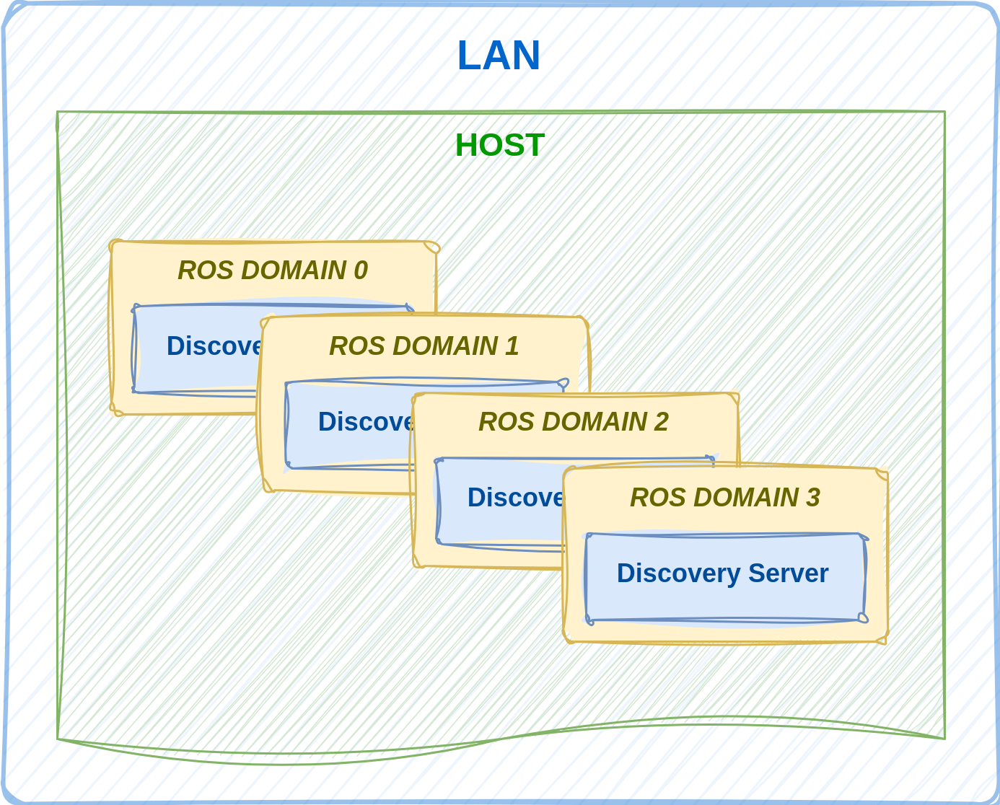
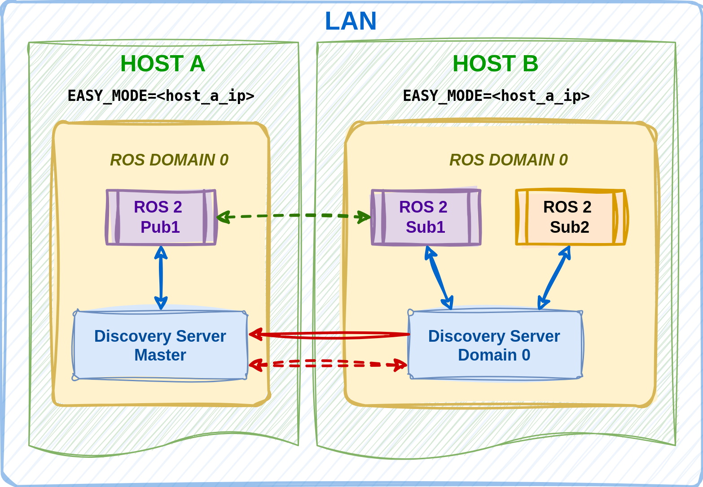
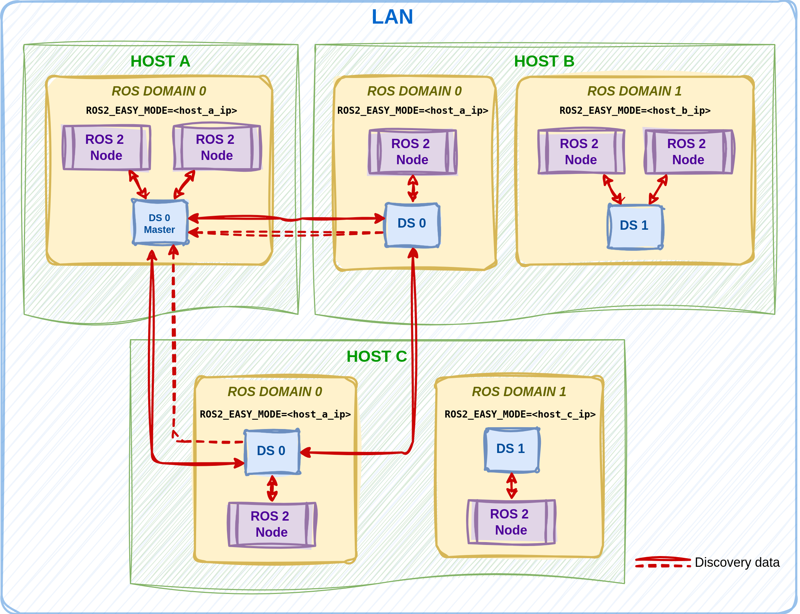

.. include:: ../../exports/alias.include

.. _easy_mode:

Easy Mode
=========

The new Vulcanexus ``Easy Mode`` aims to simplify, enhance and optimize the deployment of any ROS 2 application reinforcing the overall out-of-the-box user experience.
This section reveals its significance, operating mode and impact.

Quick Overview
^^^^^^^^^^^^^^

The Vulcanexus ``Easy Mode`` is a builtin discovery mode that simplifies to the most the deployment of ROS 2 applications with the use of `Discovery Server <https://fast-dds.docs.eprosima.com/en/latest/fastdds/discovery/discovery_server.html>`_.
To enable this feature the user only needs to set the environment variable ``ROS2_EASY_MODE=<ip>``.
This ``<ip>`` can be either the IP address of the current host or the ``<ip>`` of an external host in the same LAN acting as the central point of discovery (``master``).
By running a ROS 2 node with this environment variable, a new discovery server will be spawned in background.
The following diagram illustrates the concept:

The advantages of the Vulcanexus ``Easy Mode`` can be explored in the next section.

.. _easy_mode_benefits:

Benefits
^^^^^^^^

The use of Vulcanexus ``Easy Mode`` brings the following benefits:

* **Simplicity**: The user does not need to worry about configuring the middleware, enhancing the out-of-the-box experience.
  The user easily manages connections between domains and hosts only when needed.
* **Scalability**: The number of discovery packets is drastically reduced, and the system scalability improves.
* **Reliability**: The new discovery mode is more reliable than Simple discovery with multicast, especially in WiFi scenarios, as it uses peer to peer TCP.

Feature Insights
^^^^^^^^^^^^^^^^

This sub-section provides a detailed explanation of the Vulcanexus ``Easy Mode``.

Motivation
----------

ROS 2 users frequently prefer ROS 2 applications to function seamlessly without requiring extensive middleware configuration or network setup.
However, practical experience suggests that the default `DDS Simple discovery mechanism <https://fast-dds.docs.eprosima.com/en/latest/fastdds/discovery/simple.html#simple-discovery-settings>`_ using multicast may not be the most suitable option for many use cases.
In contrast, `eProsima's Discovery Server <https://fast-dds.docs.eprosima.com/en/latest/fastdds/discovery/discovery_server.html>`_ mechanism offers an alternative by eliminating the need for multicast discovery traffic and providing a flexible solution adaptable to various network topologies.

This method proposes a centralized discovery approach by means of a Discovery Server entity.
`Investigation and comparison of both methods <https://fast-dds.docs.eprosima.com/en/2.14.x/fastdds/ros2/discovery_server/ros2_discovery_server.html#discovery-server-v2>`_ have shown that the number of discovery packets is drastically reduced and the system scalability improves when using the Discovery Server.
The following image shows how Discovery Server simplifies the discovery graph compared with the default DDS Simple discovery for a localhost deployment of four ROS 2 nodes.

.. list-table::
   :width: 100%
   :class: borderless

   * - .. image:: ../../figures/enhancements/easy_mode/simple_discovery_multiple_hosts.png
          :width: 100%

     - .. image:: ../../figures/enhancements/easy_mode/easy_mode_multiple_hosts.png
          :width: 100%

Background
----------

*Vulcanexus* uses :ref:`Fast DDS as middleware <vulcanexus_middleware>`.
Every ROS 2 node requires to have what is called *discovery information* of other nodes beforehand in order to communicate.
Hence, before ROS 2 nodes (publishers, subscriptions, services,...) start exchanging messages, they must first discover each other.
The *Simple Discovery Protocol* is the standard protocol defined in the DDS standard.
However, it has known disadvantages in some scenarios:

* Scalability, as the number of exchanged packets increases significantly as new nodes are added.
* Requires multicast capabilities that may not work reliably in some scenarios, e.g. WiFi.

The *Fast DDS Discovery Server* offers a Client-Server framework that enables nodes to connect through an intermediary server.
Each node acts as a discovery client, transmitting its information to one or more discovery servers and obtaining discovery data from them.
This approach minimizes network traffic associated with discovery and eliminates the need for multicast communication.

Another relevant concept in ROS 2 is the `ROS_DOMAIN_ID <https://docs.ros.org/en/rolling/Concepts/Intermediate/About-Domain-ID.html>`_.
The *ROS_DOMAIN_ID* is a unique identifier that allows multiple ROS 2 applications to run on the same network without interfering with each other.
It is a way of isolating different ROS 2 application groups that do not need to communicate with each other.
Internally, it is directly related to the DDS Domain ID, which, in turn, selects different network port ranges for each domain.
See the `ROS 2 documentation <https://docs.ros.org/en/rolling/Concepts/Intermediate/About-Domain-ID.html>`_ for further explanation.

Understanding Easy Mode
-----------------------

The new Vulcanexus ``Easy Mode`` can be enabled by simply setting the environment variable ``ROS2_EASY_MODE`` to an IP (later explained).
The transports configured in this new mode include ``TCP`` for discovery and user data and ``Shared Memory`` for user data (in case it is `possible to use <https://fast-dds.docs.eprosima.com/en/latest/fastdds/transport/shared_memory/shared_memory.html>`_).

When the first ROS 2 node is launched, it will automatically spawn a Discovery Server instance in the given domain, i.e., the one specified in the ``ROS_DOMAIN_ID`` (0 by default) and make the ROS 2 node a client pointing to it.
If a Discovery Server is already running in the domain, the node will simply connect to it as a client, and no additional servers will be spawned.
Therefore, only one Discovery Server will be present in each domain.
The following diagram illustrates this concept:

Servers connection
------------------

A direct consequence of the ``Easy Mode`` is that the discovery scope of every ROS 2 node is determined by the value set in the ``<ip>`` parameter.
By setting this value to the IP of a remote host, nodes can interconnect across hosts, as long as they share the same domain.
However, if a local IP is selected, nodes will not try to discover other entities in different hosts.
It is important to clarify that setting a local IP does not prevent your nodes from being discovered by other hosts.
They can be discovered by any other host setting the ``ROS2_EASY_MODE`` variable to your local IP.

The next image shows an example of this latter case:

The dashed red arrow represents that the discovery server in Host B points to the master in Host A.
Then, the solid arrow indicates that both servers will discover each other and, finally, the green arrow signifies the data exchange between the ROS 2 nodes in purple (meaning that they share the same topic).

The act of connecting Discovery Servers can also be done in other fashions, such as:

* Setting the environment variable ``ROS_STATIC_PEERS`` with the pair ``<ip_address:domain_id>`` of the server to connect to.
* Using the ``fastdds discovery`` cli tool with the sub commands ``add`` or ``set`` followed by the domain and the ``<ip_address:domain_id>`` pair.

Please, refer to the `Fast DDS documentation <https://fast-dds.docs.eprosima.com/en/latest/fastddscli/cli/cli.html#discovery-server-cli-easy-mode>`_ for further information in this regard.

The figure below shows a general case where multiple Discovery Servers are connected to each other:

On the left part of the figure, when discovery servers in Hosts' B and C are connected to an external master server in Host A (i.e., setting ``ROS2_EASY_MODE=<host_a_ip>``), servers in Host B and C will automatically connect to each other.
This exemplifies how connecting to a Discovery Server is equivalent to connecting to all the servers that this server is connected to, as connected servers automatically form a `mesh topology <https://www.bbc.co.uk/bitesize/guides/z7mxh39/revision/6>`_.
See `Discovery Server documentation <https://fast-dds.docs.eprosima.com/en/latest/fastdds/discovery/discovery_server.html>`_.

At the same time, the right part of the figure illustrates the case of a different domain in which Hosts B and C are operating in localhost, i.e., having the ``ROS2_EASY_MODE`` to their own host's IP.
Which is perfectly valid and can coexist with the other domain.

For a practical example demo, please refer to the :ref:`easy_mode_tutorial`.

.. note::
    When ``ROS2_EASY_MODE`` is enabled, Fast DDS automatically loads a custom XML profile named ``service``.
    This profile increases the server's response timeout for ROS 2 services by modifying the
    `max_blocking_time <https://fast-dds.docs.eprosima.com/en/latest/fastdds/dds_layer/core/policy/standardQosPolicies.html#reliabilityqospolicy>`_.
    However, if the user provides an XML file that already contains a profile with the same name, Fast DDS will not
    load any extra profile.
    Instead, the `max_blocking_time <https://fast-dds.docs.eprosima.com/en/latest/fastdds/dds_layer/core/policy/standardQosPolicies.html#reliabilityqospolicy>`_ value defined in the user's XML file will be used.

Easy Mode CLI
-------------

Although the Vulcanexus ``Easy Mode`` is designed to be as simple as possible, it also provides a CLI tool to manage the Discovery Servers running in the background.
Note that using the CLI is not mandatory, as the servers are automatically spawned and monitored by a background daemon.
However, the CLI can be useful as an auxiliary tool for more advanced configurations or specific use cases.

It can be used to manage running servers, modifying their remote connections, restarting them or stopping them.

Configuration of servers launched with ``ROS2_EASY_MODE`` is available by using the following command:

.. code-block:: bash

    fastdds discovery <command> [optional -d <domain>] [optional "<master_ip:domain>"]

The following table lists the available commands for the *Fast DDS* Discovery Server CLI:

.. list-table::
    :header-rows: 1
    :align: left

    * - Command
      - Description
    * - stop
      - Stop the Discovery Server daemon if it is executed with no arguments. If a domain is |br|
        specified with the ``-d`` argument it will only stop the corresponding server and the daemon |br|
        will remain alive.
    * - add
      - Add new remote Discovery Servers to the local server.
        This will connect both servers and |br|
        their sub-networks without modifying existing remote servers. |br|
    * - set
      - Rewrite the remote Discovery Servers connected to the local server.
        This will replace |br|
        existing remote servers with the new connections. |br|
    * - list
      - List local active Discovery Servers created with the CLI Tool or the ``ROS2_EASY_MODE=<ip>``.
    * - auto
      - Handle the daemon start-up automatically and creates a Discovery Server in the specified |br|
        domain (0 by default).
    * - start
      - Start the Discovery Server daemon with the remote connections specified. |br|

.. list-table::
    :header-rows: 1
    :align: left

    * - Option parameters
      - Description
    * - ``-d  --domain``
      - Selects the domain of the server to target for this action.
        It defaults to 0 if |br|
        this argument is missing and no value is found in the ``ROS_DOMAIN_ID``
        environment variable.
    * - ``<remote_server_list>``
      - It is only accepted with the `auto`, `start`, `add` and `set` commands.
        It is a list of |br|
        remote servers to connect to with the following structure: "<IP:domain>;<IP:domain>;...".

.. important::
    It is important to remark that spawning a new server from the CLI which will be later used by the ROS 2 nodes requires to:

    * Set the ``ROS2_EASY_MODE`` environment variable in CLI command.
    * Select the master server IP and pass it as an argument to the CLI command.

    .. code-block:: bash

        ROS2_EASY_MODE=<master_ip> fastdds discovery auto -d <domain> <master_ip>:<domain>

    Otherwise, the spawned server will not be available for the ROS 2 nodes.
    It is recommended to run new servers directly from the ROS 2 nodes to avoid this issue.

Examples
""""""""

1.  Stop all running Easy Mode Discovery Servers and shut down Fast DDS daemon:

    .. code-block:: bash

        fastdds discovery stop

2.  Stop the Easy Mode Discovery Server running in domain 0:

    .. code-block:: bash

        fastdds discovery stop -d 0

3.  Start an Easy Mode Discovery Server in the domain 7 as master:

    .. code-block:: bash

        ROS2_EASY_MODE=127.0.0.1 fastdds discovery auto -d 7 127.0.0.1:7

    OR

    .. code-block:: bash

        ROS_DOMAIN_ID=7 ROS2_EASY_MODE=127.0.0.1 fastdds discovery auto 127.0.0.1:7

3.  Start an Easy Mode Discovery Server in the domain 3 pointing to a master in IP 192.168.1.42:

    .. code-block:: bash

        ROS2_EASY_MODE=192.168.1.42 fastdds discovery auto -d 3 192.168.1.42:3

    OR

    .. code-block:: bash

        ROS_DOMAIN_ID=3 ROS2_EASY_MODE=192.168.1.42 fastdds discovery auto 192.168.1.42:3
