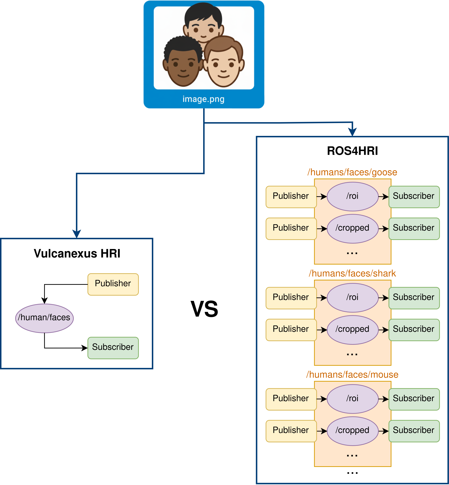

.. include:: ../../exports/alias.include

.. _enhancements_hri_msgs:

HRI Message Definitions
=======================

Background
----------

**Human-Robot Interaction** (HRI) is a booming research area that focuses on enabling robots to understand and interact with humans in a natural and effective manner.
In order to enhance this interaction, it is crucial that robots can perceive and interpret human behaviors, emotions, and intentions.
This requires the exchange of rich and complex data between various modules, such as perception, cognition, and action.
To facilitate this data exchange, standardized message definitions are essential.
Moreover, within the ROS 2 ecosystem, where messages act as the primary means of communication, the way these messages are defined directly impacts the effectiveness and scalability of HRI systems and robots.

The `ROS REP-155 <https://ros.org/reps/rep-0155.html>`_ defines a set of guidelines for structuring Human-Robot Interaction data within the ROS 2 ecosystem.
The specification aims to provide broadly accepted interfaces and pipelines for HRI applications.
Following this approach, the `ROS4HRI <https://github.com/ros4hri>`_ framework has developed a series of ROS 2 packages that implements basic HRI functionalities such as face detection, gesture recognition or voice processing.

One of the key aspects of the ROS REP-155 which has been implemented by ROS4HRI is the use of dedicated namespaces for each detected human entity.
For example, when a new face is detected, a new namespace such as ``/humans/faces/ja8v7/`` is created.
Under this namespace, multiple topics coexist to publish complementary information:

- ``/humans/faces/ja8v7/roi``
- ``/humans/faces/ja8v7/cropped``
- ``/humans/faces/ja8v7/landmarks``
- ``/humans/faces/ja8v7/pose``
- And up to 8 topics in total for each face instance.

Similarly, body detections replicate this behavior, creating one namespace for each detected body, but working with up to 6 topics under each detected body namespace.

This design provides modularity and separation of concerns, but introduces significant complexity in terms of middleware management, discovery, and scalability.

Motivation of Vulcanexus HRI Messages
-------------------------------------

While REP-155 and ROS4HRI paved the way for standardized HRI integration, their namespace-based design leads to a rapid increase in the number of topics, publishers, and subscribers as soon as multiple humans are detected.

Assuming a scenario where a perception module providing the maximum possible information detects multiple faces and bodies in a scene, the following DDS entities are created:

- **For each detected face**:
  8 topics x 1 publisher x 1 subscriber = **16 new entities**

- **For each detected body**:
  6 topics x 1 publisher x 1 subscriber = **12 new entities**

In practical scenarios with many people, this quickly scales to thousands of DDS entities.
For example, in a scene with 10 detected faces and 10 detected bodies, the total number of DDS entities would be:

- 10 detected faces x 16 entities = **160 entities** and **80 topics**
- 10 detected bodies x 12 entities = **120 entities** and **60 topics**
- **Total = 280 entities** and **140 topics**

This explosion of entities increases network traffic, discovery overhead, and resource consumption, while also making visualization of data (e.g., in RViz2) much more complex.
Not only that, but the management of 140 topics and their corresponding publishers and subscribers becomes a significant challenge for developers, leading to increased complexity in code maintenance and potential performance bottlenecks.
Debugging and monitoring such a system also becomes cumbersome, and any attempt to scale the system further (e.g., adding more humans or more data types) exacerbates these issues.

Enhancements with Vulcanexus HRI Messages
-----------------------------------------

The ``hri_msgs`` package within *Vulcanexus* introduces a new approach by leveraging **Fast DDS keyed topics** and message aggregation mechanisms.

Instead of creating a dedicated namespace and multiple topics per human, keyed topics allow all entities of the same type (e.g., faces or bodies) to be published on a single topic.
Each instance within the topic is uniquely identified by its key (the human ID).
Hence, only one publisher and one subscriber are needed per topic, **regardless of the number of detected humans**.

Using the same example as before, with keyed topics, the number of DDS entities is drastically reduced:

.. list-table::
   :header-rows: 1
   :widths: 20 20 20 40
   :class: longtable

   * - Scenario
     - REP-155 |br| ROS4HRI
     - Vulcanexus HRI (``hri_msgs``)
     - Notes
   * - **Faces** |br| **(10 detected)**
     -
       - 160 entities
       - 80 topics
     -
       - 16 entities
       - 8 topics
     - Keys allow **all faces topics** to share a single topic and publisher/subscriber pair.
   * - **Bodies** |br| **(10 detected)**
     -
       - 120 entities
       - 60 topics
     -
       - 12 entities
       - 6 topics
     - Keys allow **all bodies topics** to share a single topic and publisher/subscriber pair.
   * - **Total (10 faces + 10 bodies)**
     -
       - **280 entities**
       - 140 topics
     -
       - **28 entities**
       - 14 topics
     - With keyed topics, the number of entities and topics remains **constant**, no matter how many humans are detected.

Additionally, ``hri_msgs`` provides new messages that aggregate related data into single messages, providing all sub-topics of a frame (e.g., face or body) in one message.
For example, instead of having separate topics for face ROI, landmarks, pose, etc., all this information is encapsulated in a single `FaceList` message.
This further reduces the number of topics to just 2 topics in total for both faces and bodies (``humans/faces`` and ``humans/bodies``).

The final tally is impressive:

.. list-table::
   :header-rows: 1
   :widths: 20 20 20 40
   :class: longtable

   * - Scenario
     - REP-155 |br| ROS4HRI
     - Vulcanexus HRI (``hri_msgs``) with aggregated messages
     - Notes
   * - **Faces** |br| **(10 detected)**
     -
       - 160 entities
       - 80 topics
     -
       - 2 entities
       - 1 topic
     - Aggregated messages with keys allow **all faces** to share a single topic and publisher/subscriber pair.
   * - **Bodies** |br| **(10 detected)**
     -
       - 120 entities
       - 60 topics
     -
       - 2 entities
       - 1 topic
     - Aggregated messages with keys allow **all bodies** to share a single topic and publisher/subscriber pair.
   * - **Total (10 faces + 10 bodies)**
     -
       - **280 entities**
       - 140 topics
     -
       - **4 entities**
       - 2 topics
     - With aggregated messages and keyed topics, the number of entities and topics remains **constant**, no matter how many humans are detected.

These constant values contrast sharply with the linear growth seen in the REP-155 model.

This reduction is dramatic and has direct consequences:

- **Lower resource usage**: fewer publishers, subscribers, and topics to maintain.
- **Simplified discovery** and **reduced Network traffic**: fewer DDS entities to be discovered and matched.
- **Simpler visualization**: all the data of a frame is available in a single aggregated message, making display
modules more efficient and easier to implement.

Conclusion
----------

The introduction of keys and aggregation in ``hri_msgs`` represents a significant step forward in the efficiency of HRI data exchange within ROS 2.
By replacing the REP-155 namespace-based model with keyed topics, Vulcanexus reduces hundreds of entities to just a handful, even in scenarios with multiple humans.

This not only improves scalability and performance but also simplifies the integration of HRI modules, ensuring that developers can focus on higher-level interaction logic rather than managing complex communication infrastructures.

In summary, ``hri_msgs`` evolves the concepts introduced in ROS4HRI into a fully ROS 2-native package that leverages keyed topics to maximize efficiency, maintainability, and interoperability across the Vulcanexus HRI suite.
This results in a powerful framework that simplifies the implementation of complex HRI pipelines while optimizing the use of computational and communication resources.
