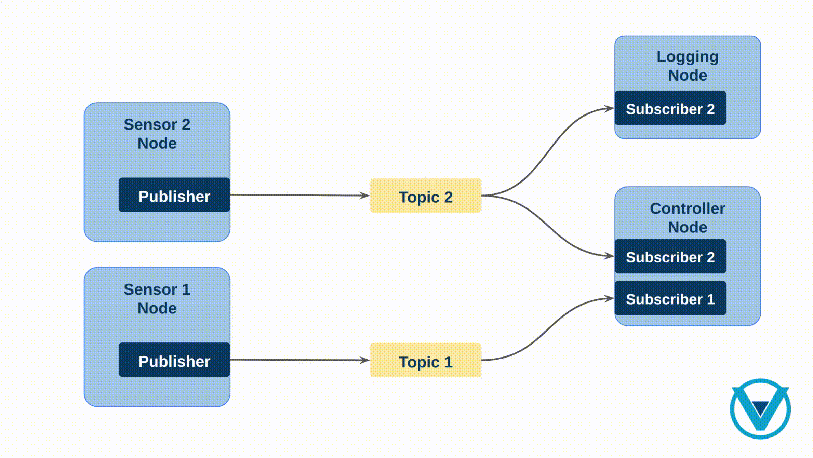

.. _topic_keys:

Topic Keys
==========

Topic Keys endow developers with the ability of orchestrating efficient and tailored data distribution,
facilitating streamlined communication and enhancing system scalability.
In this exploration, we unravel their significance, working principles, and how to use them.

Background
^^^^^^^^^^
*Vulcanexus* uses :ref:`Fast DDS as middleware <vulcanexus_middleware>`.
One of the core concepts involved in the communication architecture are topics,
which serve as the bridge that enable data exchange among nodes within a particular system.

Topics are named communication channels that allow nodes (software modules) in a robotic system
to exchange messages with each other. These messages can contain various types of data, such as sensor readings,
control commands, or status updates, enabling different parts of the robot to collaborate and share information.

The following image depicts a simple scenario where two sensors publish data in different topics, and two nodes,
the first ``Logging`` node subscribes to the Sensor 2 output topic, and the ``Controller`` node that subscribes
to both topics.

When any new data is available in the sensors, it is transmitted through the corresponding topic and all the subscribers
attached to that topic receive the message.

Understanding Keyed Topics
^^^^^^^^^^^^^^^^^^^^^^^^^^

Now, let's delve into the concept of keyed topics. While traditional topics allow nodes to exchange messages freely,
keyed topics add an additional logic of organization to this communication process.

In a keyed topic, each message is associated with a **unique key**, which serves as an identifier for that message.
This key allows nodes to differentiate between messages with similar content but different contexts or origins.
In this sense, keys can be thought as the "primary key" of a database.
Each unique key corresponds to a specific **data instance** of the message and describes a part of the entire data object.

For example, imagine a robotic system where multiple sensors are generating data about different objects in the environment.
By using keyed topics, each sensor can publish its data with a unique key corresponding to the object being observed.
This allows other nodes in the system to subscribe to specific object instances rather than receiving all sensor data indiscriminately.

Following with the example above, the next image illustrates this concept, where the sensors publish data with a unique key (sensor id)
corresponding to the object being observed.

.. image:: ../../figures/enhancements/keys/keyed-topics.gif

In this case, only one topic and subscriber per node is required to receive the data of interest in each case, while efficiently filtering
out the irrelevant pieces of data.

.. _benefits_of_topic_keys:

Benefits of Keyed Topics
^^^^^^^^^^^^^^^^^^^^^^^^

The use of topic keys report several benefits, including:

* Efficient middleware infrastructure and data distribution: the use of keyed topics reduce the amount of entities (subscribers, publishers and topics) needed in
  the data flow of the application which implies a more efficient usage of resources and bandwidth.
* Improved message filtering: Nodes have the ability to subscribe selectively to messages by utilizing their keys,
  allowing for precise filtering and minimizing superfluous message handling.
* Enhanced scalability: keyed topics enable the creation of more complex and scalable robotic systems by allowing nodes to
  communicate with specific data instances rather than receiving all messages indiscriminately
* Easy integration with databases. Individual records in a table are uniquely identified by the values of the fields marked as the “primary key” for that table.
  If those same fields are also marked as the key fields for the corresponding Topic, then the integration is seamless and the RTI Connext DDS data cache can work hand-in-hand with the database table storage.
* A better history management. *Fast DDS* maintains a cache of recent updates, typically the last 10 changes,
  for each instance. This caching mechanism, configured separately for publishers and subscribers, prevents instances with rapid changes from overwriting the latest value of another instance that changes less frequently.
  Moreover, this per-instance cache can be managed by the source application or a persistence service for late-joining subscribers, ensuring they initialize with the current value or recent changes of each object.
  Without keyed topics, the middleware lacks the ability to intelligently cache data on a per-instance basis, resulting in late joiners needing to process a larger history before accessing the current value of an instance.

There are by far more benefits than downsides when using keyed topics. Indeed, there are hardly any reasons to opt against keyed topics, perhaps stemming from concerns about added application complexity,
the necessity for a higher portability, or concerns about performance impact, though evidence has shown this impact to be negligible.

In summary, keyed topics enhance the flexibility, efficiency, and organization of communication by associating unique keys with each message.
By leveraging keyed topics, developers can design more robust and scalable robotic applications capable of handling diverse data sources
and complex environments.

Using Topic Keys
^^^^^^^^^^^^^^^^

For details on how to use topic keys in *Vulcanexus*, please refer to the :ref:`Documented Tutorial <topic_keys_tutorial>` in this regard.
