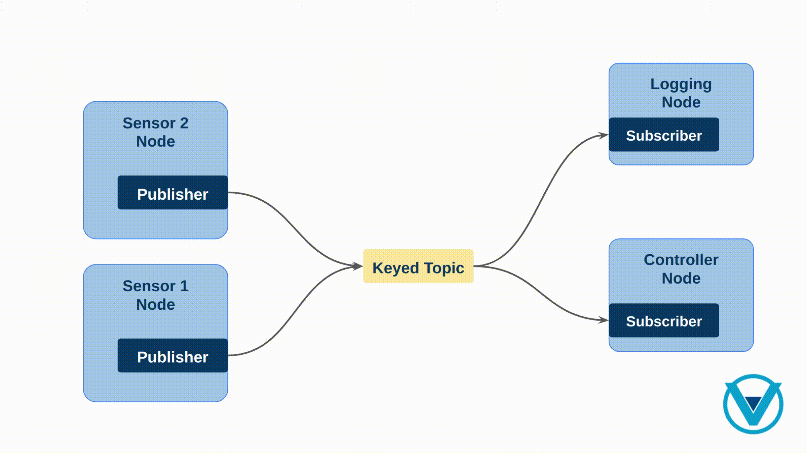

.. include:: ../../../../exports/alias.include

.. _topic_keys_tutorial:

Topic Keys Tutorial
===================

This tutorial aims to demonstrate the use of topic keys in *Vulcanexus* by simulating a scenario in which multiple sensors are transmitting their readings to a controller that processes them.

Background
----------

In Vulcanexus, a *Topic* is a communication channel used for publishing and subscribing to updates of object states.
The value of data associated with a topic changes over time and each of these values are known as *data samples*.
:ref:`topic_keys` refer to topics where each data sample represent an update of the state of a specific object  (known as *instance*) among all those objects represented in the topic.

Unlike standard topics, where each data sample updates the entire object state with every data sample, keyed topics allow the user to reduce the number of required resources (topics, along with its associated publisher and subscriber) by multiplexing updates of several objects of the same kind into a single resource.
Please, refer to the documented section on :ref:`topic_keys` for a more detailed explanation.

Creating custom IDL messages
^^^^^^^^^^^^^^^^^^^^^^^^^^^^

In Vulcanexus, users can define their own :ref:`custom messages<CustomInterfaces>`.
In addition, it is also possible to create custom messages using the `IDL (Interface Definition Language) <https://www.omg.org/spec/IDL/4.2/About-IDL>`_ format following a standardized way of defining the message structure.
Next example depicts how to define a custom message using the IDL format in Vulcanexus:

.. tab-set::

    .. tab-item:: IDL

        .. code-block:: bash

            # ExampleMsg.idl
            module package_name {
              module msg {
                struct ExampleMsg {
                  string field;
                  short another_field;
                  double yet_another_field;
                };
              };
            };

    .. tab-item:: MSG

        .. code-block:: bash

            # ExampleMsg.msg equivalent
            string field;
            short another_field;
            double yet_another_field;

As it can be seen, using the IDL format requires naming the upper module with the same name as the package name containing it.
Furthermore, the message structure shall be named as the file containing it, and it shall be declared within a *msg* module nested in the package name one.

One of the advantages of defining messages in Interface Definition Language (IDL) is the ability to use annotations.
Annotations are metadata to the data structure definition that provide additional information about IDL constructs such as modules, interfaces, operations, attributes, and data types.
They are relevant for code generation, documentation, or other purposes.
Annotations in IDL typically follow the ``@`` symbol and can be applied to various IDL constructs.
Please, refer to the tutorial about :ref:`communicating Vulcanexus and Fast DDS <dds2vulcanexus_topic>`, where the way to generate types from IDL files is shown.

The ``@key`` annotation is used to designate a member as key, which is covered in the following section.

Creating Keyed Messages
^^^^^^^^^^^^^^^^^^^^^^^

Keyed topics exist when one or more fields in the data structure are annotated as keys.
These key fields serve as unique identifiers for topic instances in order to organize and manage the data samples, facilitating efficient access, retrieval, and filtering of data based on the specified key criteria.

The ``@key`` annotation designates a field as a key for the given topic type, which can have zero or more key fields and can be applied to structure fields of various types:

* Any primitive, such as booleans, integers, characters, strings or sequences.
* Other existing or defined messages. If those have defined an inner key member, then those fields will we used as part of the key.
  Otherwise, the key will be the concatenation of all the fields.

In order to specify multiple keys, separate ``@key`` annotations are used.
The following example shows how to define a keyed message using the IDL format in Vulcanexus:

.. code-block:: bash

    # KeyedMsgName.idl
    module package_name {
      module msg {
        struct KeyedMsgName {
          @key long key;
          string data;
        };
      };
    };

.. note::

    Currently, the only supported message format that can be annotated with ``@key`` is *.idl*.
    Neither ``.msg`` nor ``.srv`` files support annotations yet.

Prerequisites
-------------

* It is recommended to have a basic understanding of ``Topic Keys`` introduced in the :ref:`topic_keys` section.
* An up-to-date (latest) Vulcanexus installation using one of the following installation methods:

  * :ref:`linux_binary_installation`
  * :ref:`linux_source_installation`
  * :ref:`docker_installation`

Preparing the demo package
--------------------------

Lets start by setting up the Vulcanexus environment.
For this, there are two possible options:

#.  Running the Vulcanexus Docker image.

    Run the Vulcanexus Docker image with:

    .. code-block:: bash

        docker run -it --rm ubuntu-vulcanexus:{DISTRO}-desktop

    Then, within the container, source the Vulcanexus installation with:

    .. code-block:: bash

            source /opt/vulcanexus/{DISTRO}/setup.bash

#.  Running the tutorial on the local host.
    For this second option, it is necessary to have the ``vucanexus-kilted-base`` package installed.

    Source the following file to setup the Vulcanexus environment:

    .. code-block:: bash

            source /opt/vulcanexus/{DISTRO}/setup.bash

Retrieving the sources
^^^^^^^^^^^^^^^^^^^^^^

In order to retrieve the example demo code, create a new workspace and download the demo package sources as indicated below:

.. code-block:: bash

    # Create directory structure
    mkdir -p ~/vulcanexus_ws/src/demo_keys_cpp
    mkdir ~/vulcanexus_ws/src/demo_keys_cpp/msg
    mkdir ~/vulcanexus_ws/src/demo_keys_cpp/src
    mkdir ~/vulcanexus_ws/src/demo_keys_cpp/launch
    cd ~/vulcanexus_ws/src/demo_keys_cpp

    # Download demo package source code
    wget -O CMakeLists.txt https://raw.githubusercontent.com/eProsima/vulcanexus/{DISTRO}/docs/resources/tutorials/core/deployment/keys/demo_keys_cpp/CMakeLists.txt
    wget -O package.xml https://raw.githubusercontent.com/eProsima/vulcanexus/{DISTRO}/docs/resources/tutorials/core/deployment/keys/demo_keys_cpp/package.xml
    wget -O README.md https://raw.githubusercontent.com/eProsima/vulcanexus/{DISTRO}/docs/resources/tutorials/core/deployment/keys/demo_keys_cpp/README.md
    wget -O msg/SensorDataMsg.idl https://raw.githubusercontent.com/eProsima/vulcanexus/{DISTRO}/docs/resources/tutorials/core/deployment/keys/demo_keys_cpp/msg/SensorDataMsg.idl
    wget -O msg/KeyedSensorDataMsg.idl https://raw.githubusercontent.com/eProsima/vulcanexus/{DISTRO}/docs/resources/tutorials/core/deployment/keys/demo_keys_cpp/msg/KeyedSensorDataMsg.idl
    wget -O src/multiple_topic_sensor.cpp https://raw.githubusercontent.com/eProsima/vulcanexus/{DISTRO}/docs/resources/tutorials/core/deployment/keys/demo_keys_cpp/src/multiple_topic_sensor.cpp
    wget -O src/multiple_topic_controller.cpp https://raw.githubusercontent.com/eProsima/vulcanexus/{DISTRO}/docs/resources/tutorials/core/deployment/keys/demo_keys_cpp/src/multiple_topic_controller.cpp
    wget -O src/single_topic_sensor.cpp https://raw.githubusercontent.com/eProsima/vulcanexus/{DISTRO}/docs/resources/tutorials/core/deployment/keys/demo_keys_cpp/src/single_topic_sensor.cpp
    wget -O src/single_topic_controller.cpp https://raw.githubusercontent.com/eProsima/vulcanexus/{DISTRO}/docs/resources/tutorials/core/deployment/keys/demo_keys_cpp/src/single_topic_controller.cpp
    wget -O src/keyed_sensor.cpp https://raw.githubusercontent.com/eProsima/vulcanexus/{DISTRO}/docs/resources/tutorials/core/deployment/keys/demo_keys_cpp/src/keyed_sensor.cpp
    wget -O src/keyed_controller.cpp https://raw.githubusercontent.com/eProsima/vulcanexus/{DISTRO}/docs/resources/tutorials/core/deployment/keys/demo_keys_cpp/src/keyed_controller.cpp
    wget -O launch/multiple_topic_sensors_launch.py https://raw.githubusercontent.com/eProsima/vulcanexus/{DISTRO}/docs/resources/tutorials/core/deployment/keys/demo_keys_cpp/launch/multiple_topic_sensors_launch.py
    wget -O launch/single_topic_sensors_launch.py https://raw.githubusercontent.com/eProsima/vulcanexus/{DISTRO}/docs/resources/tutorials/core/deployment/keys/demo_keys_cpp/launch/single_topic_sensors_launch.py
    wget -O launch/keyed_sensors_launch.py https://raw.githubusercontent.com/eProsima/vulcanexus/{DISTRO}/docs/resources/tutorials/core/deployment/keys/demo_keys_cpp/launch/keyed_sensors_launch.py

Like any other ROS 2 related package, the external dependencies are listed in the ``package.xml``.
The ``CMakeLists.txt`` file defines the different targets to be built and the dependencies between them.
Note that it is built in a component manner meaning that the nodes defined in the source files can be also loaded as composable plugins apart from being executed as standalone nodes.
The *src/* directory contains the core source files for the different nodes that will be executed in the demo.
The launch files for sensors are also provided in the *launch/* directory in which 10 different nodes are launched for each one of the cases that will be later explained.
Finally, the *msg/* directory contains two different IDL message definitions, one with key annotations (sensor_id) and another without it.

The resulting directory structure should be:

.. code-block::

    ~/vulcanexus_ws
     ├──src
        ├── demo_keys_cpp
            ├── CMakeLists.txt
            ├── README.md
            ├── launch
            │   ├── keyed_sensors_launch.py
            │   ├── multiple_topic_sensors_launch.py
            │   └── single_topic_sensors_launch.py
            ├── msg
            │   ├── KeyedSensorDataMsg.idl
            │   └── SensorDataMsg.idl
            ├── package.xml
            └── src
                ├── keyed_controller.cpp
                ├── keyed_sensor.cpp
                ├── multiple_topic_controller.cpp
                ├── multiple_topic_sensor.cpp
                ├── single_topic_controller.cpp
                └── single_topic_sensor.cpp

Building the demo package
^^^^^^^^^^^^^^^^^^^^^^^^^

Once the environment has been setup and the demo package sources are available, we are ready to build the workspace.
Get into the root of the workspace and build it with the following commands:

.. code-block:: bash

    source /opt/vulcanexus/{DISTRO}/setup.bash
    cd ~/vulcanexus_ws
    colcon build

Running the demo
----------------

The tutorial demo consists of a controller node that subscribes to the data published by multiple sensors.
Each of the sensors are identified by a *sensor_id* and publish data to the controller at different rates, in particular, the publication period (in seconds) is the *sensor_id* times 1.
Three different valid approaches are used to address the situation:

* In the first one, multiple sensors are publishing data to the controller using different topics for each sensor and the controller subscribing to each one of them.
* In the second approach, multiple sensors publish data to the controller using a single standalone topic.
* Finally, in the third one, the sensors use a single keyed topic defining a single data instance per unique *sensor_id*.

In addition, all the publications and subscriptions use the following QoS settings:

* History QoS: ``KEEP_LAST 1``.
* Reliable communication.
* Transient Local durability.

This is set this way to recreate late joining of the controller to the application and evaluate the behavior in each of the three different scenarios.
The following diagram depicts the three different scenarios:

.. image:: ../../../../figures/tutorials/core/keys/tutorial_diagram.svg
    :align: center
    :width: 90%

Lets start with the first scenario.
Run the demo by executing the following commands in separate terminals:

.. note::

    If a docker deployment was preferred, it would be necessary to attach the other two terminals to the running docker container before executing the above commands.
    This can be done by running ``docker exec -it <container_name> /bin/bash``.

.. tab-set::

    .. tab-item:: Shell 1 (Sensors)

        .. code-block:: bash

            source ~/vulcanexus_ws/install/setup.bash
            ros2 launch demo_keys_cpp multiple_topic_sensors_launch.py

    .. tab-item:: Shell 2 (Controller)

        .. code-block:: bash

            source ~/vulcanexus_ws/install/setup.bash
            ros2 run demo_keys_cpp multiple_topic_controller

The resulting output should be similar to the following:

.. raw:: html

    <video width=100% height=auto autoplay loop controls muted>
        <source src="../../../../../_static/resources/tutorials/core/deployment/keys/multiple_topics.mp4">
        Your browser does not support the video tag.
    </video>

It is important to note that this initial approach is not the most efficient one, as it entails the creation of multiple topics, publishers, and subscriptions.
Furthermore, apart from being inefficient, it also makes the application more complex, harder to maintain, and resource demanding.
Moreover, as a consequence of creating far more entities than needed, the application incurs in an unnecessary discovery overhead.

Lets go a step further.
In this second approach a single topic is used in which all the sensors will publish their data (without using a keyed topic).
Run the demo by executing the following commands in separate terminals:

.. tab-set::

    .. tab-item:: Shell 1 (Sensors)

        .. code-block:: bash

            source ~/vulcanexus_ws/install/setup.bash
            ros2 launch demo_keys_cpp single_topic_sensors_launch.py

    .. tab-item:: Shell 2 (Controller)

        .. code-block:: bash

            source ~/vulcanexus_ws/install/setup.bash
            #Wait until sensor[10] publishes the first data (10 secs)
            ros2 run demo_keys_cpp single_topic_controller

Which leads to an output similar to the one shown below:

.. raw:: html

    <video width=100% height=auto autoplay loop controls muted>
        <source src="../../../../../_static/resources/tutorials/core/deployment/keys/single_topics.mp4">
        Your browser does not support the video tag.
    </video>

This second scenario illustrates that using one single topic, a late-joining controller will not recover the state of all the sensors when it joins the application.
This is easily noticeable in the case of sensor with *id* 10; the controller will not receive the latest data published by this sensor until it publishes a new one.
Furthermore, sensors publishing at higher rates (sensors 1~3) can overwrite the data of low rate sensors, causing starvation even in the case of augmenting the history size.
These are severe problems that should be avoided.

Now, lets move on to the third approach for addressing the problem.
Start, or reuse previous opened terminals and run the following commands:

.. tab-set::

    .. tab-item:: Shell 1 (Sensors)

        .. code-block:: bash

            source ~/vulcanexus_ws/install/setup.bash
            ros2 launch demo_keys_cpp keyed_sensors_launch.py

    .. tab-item:: Shell 2 (Controller)

        .. code-block:: bash

            source ~/vulcanexus_ws/install/setup.bash
            #Wait until sensor[10] publishes the first data (10 secs)
            ros2 run demo_keys_cpp keyed_controller

The resulting output should be similar to the following:

.. raw:: html

    <video width=100% height=auto autoplay loop controls muted>
        <source src="../../../../../_static/resources/tutorials/core/deployment/keys/keyed_topic.mp4">
        Your browser does not support the video tag.
    </video>

In this final case, the controller is able to successfully recover the latest state of each sensor (data instance) when it joins the application.
In addition, it uses optimum resources (it only requires one topic and one subscription) and guarantees a minimum discovery overhead.
Hence, it is by using topic keys when the reception of the latest status of each instance (sensor) is assured.
This is because the Quality of Service settings are applied per data instance.
These and further benefits can be explored in :ref:`benefits_of_topic_keys`.
For learning how to combine keyed topics with content filter topic in *Vulcanexus*, please refer to the :ref:`filtered_topic_keys_tutorial`.

