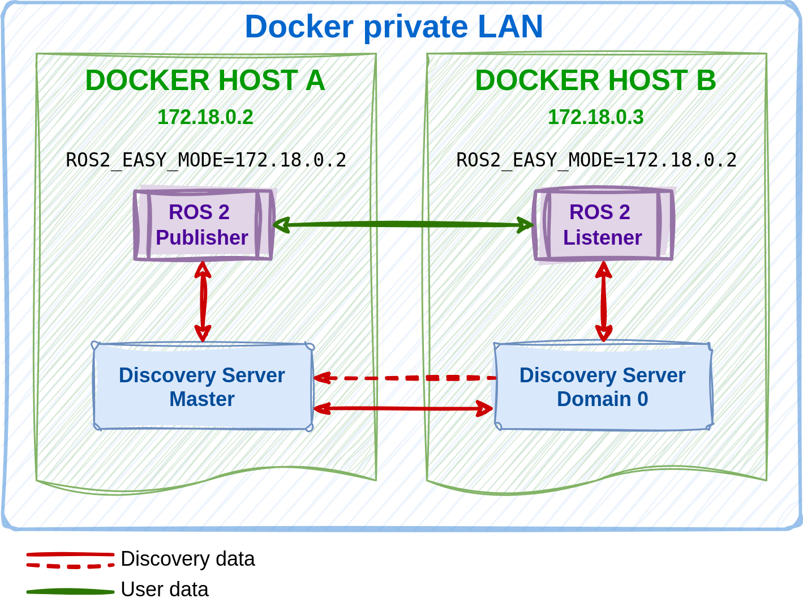

.. include:: ../../../../exports/alias.include

.. _easy_mode_tutorial:

Easy Mode Tutorial
==================

This tutorial aims to demonstrate the new :ref:`easy_mode` feature in *Vulcanexus* by running a simple talker-listener example demo.

.. contents::
    :depth: 2
    :local:
    :backlinks: none

Prerequisites
-------------

* It is recommended to have a basic understanding of Vulcanexus ``Easy Mode`` introduced in the :ref:`easy_mode` section.
* An up-to-date (latest) Vulcanexus installation using one of the following installation methods:

  * :ref:`linux_binary_installation`
  * :ref:`linux_source_installation`
  * :ref:`docker_installation`

Preparation
-----------

Lets start by setting up the Vulcanexus environment.
First, create an isolated Docker network for the Vulcanexus containers:

.. code-block:: bash

        docker network create --subnet=172.18.0.0/16 vulcanexus_net

Run two containers of the Vulcanexus Docker image and source the Vulcanexus installation with:

.. code-block:: bash

    # Terminal 1
    docker run --net vulcanexus_net --ip 172.18.0.2 -it --rm ubuntu-vulcanexus:{DISTRO}-desktop
    source /opt/vulcanexus/{DISTRO}/setup.bash

    # Terminal 2
    docker run --net vulcanexus_net --ip 172.18.0.3 -it --rm ubuntu-vulcanexus:{DISTRO}-desktop
    source /opt/vulcanexus/{DISTRO}/setup.bash

.. note::

    It is also possible to run the tutorial between two hosts sharing the same network.

Running the demo
----------------

The tutorial consists in two docker containers (hosts) running a ROS 2 talker - listener example with the new Vulcanexus ``Easy Mode`` enabled.
Both hosts are in the same network and domain id as shown in the following diagram:

Discovery server in Host A will serve as the master server.
Hence, the IP address of Host A will be used to enable the ``Easy Mode`` in both containers.
Run the following commands in each container:

.. code-block:: bash

    # Container 1
    ROS2_EASY_MODE=172.18.0.2 ros2 run demo_nodes_cpp talker

    # Container 2
    ROS2_EASY_MODE=172.18.0.2 ros2 run demo_nodes_cpp listener

.. note::

    If the tutorial is run using two hosts, the IP address of the ``ROS2_EASY_MODE`` environment variable needs to be set to the IP address of the first host.
    It is also possible to run the demo in a single host by opening two terminals and running the commands in each terminal.
    In this case, the IP address should be set to the hosts's IP and only one discovery server will be spawned.

After a moment, the listener should start receiving samples from the talker, meaning that both Discovery Servers are now connected to each other.
As the talker and listener nodes share the same topic ``chatter``, nodes are discovered and data exchange can happen.
Further benefits of using the new ``Easy Mode`` are detailed in the :ref:`easy_mode_benefits` section.

To stop the Discovery Server spawned in the background and the Fast DDS Daemon, run the following command:

.. code-block:: bash

    fastdds discovery stop

Otherwise, both will be killed after stopping the container.
