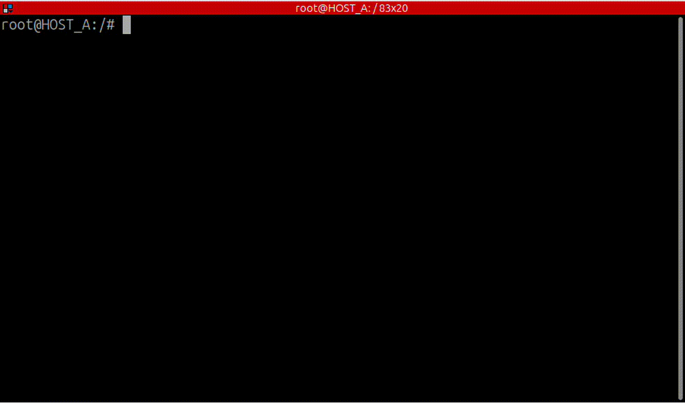

.. include:: ../../../../exports/alias.include

.. _easy_mode_cli_tutorial:

Easy Mode CLI Tutorial
======================

This tutorial demonstrates the CLI usage of new :ref:`easy_mode` feature in *Vulcanexus*,
serving as a follow up of the :ref:`easy_mode_tutorial`. We will run two talkers and two listeners
distributed across different hosts and domains and we will use the :ref:`easy_mode_cli` to connect and disconnect
them as needed.

.. note::

    The :ref:`easy_mode` feature works automatically and does not require the use of any of the following CLI commands in order to work.
    However, the following CLI commands  can be useful in certain complex scenarios.

.. contents::
    :depth: 2
    :local:
    :backlinks: none

Prerequisites
-------------

As mentioned earlier, this tutorial is a follow up of the :ref:`easy_mode_tutorial`. Therefore,
it is essential to fulfill the prerequisites section of that tutorial beforehand.

Preparation
-----------

We will be working with up to 3 different hosts distributed in Docker containers.
First, create an isolated Docker network for the Vulcanexus containers:

.. code-block:: bash

        docker network create --subnet=172.18.0.0/16 vulcanexus_net

Run three containers using the Vulcanexus Docker image and source the Vulcanexus installation. For convenience,
we will store the IP addresses of the other hosts, as well as the container's own IP address, in environment variables.

.. code-block:: bash

    # Terminal 1 -> Host A
    docker run --net vulcanexus_net --ip 172.18.0.2 -it --rm eprosima/vulcanexus:{DISTRO}-desktop
    export OWN_IP=172.18.0.2 && export B_IP=172.18.0.3 && export C_IP=172.18.0.4

    #Terminal 2 -> HOST A (just another terminal from the same container as Terminal 1)
    docker exec -it $(docker ps -q) bash
    source /opt/vulcanexus/{DISTRO}/setup.bash
    export OWN_IP=172.18.0.2 && export B_IP=172.18.0.3 && export C_IP=172.18.0.4

    # Terminal 3 -> Host B
    docker run --net vulcanexus_net --ip 172.18.0.3 -it --rm eprosima/vulcanexus:{DISTRO}-desktop
    export A_IP=172.18.0.2 && export OWN_IP=172.18.0.3 && export C_IP=172.18.0.4

    # Terminal 4 -> Host C
    docker run --net vulcanexus_net --ip 172.18.0.4 -it --rm eprosima/vulcanexus:{DISTRO}-desktop
    export A_IP=172.18.0.2 && export B_IP=172.18.0.3 && export OWN_IP=172.18.0.4

.. note::

    It is also possible to run the tutorial between three hosts sharing the same network.

Running the demo
----------------

In this tutorial we will explore the CLI commands introduced in the :ref:`easy_mode_cli` section.

Before demonstrating each command, we will first showcase the standard :ref:`easy_mode` usage without CLI commands.
This will help establish the context for the subsequent CLI demonstrations.

* Host B will run a listener node in domain 1, along with its associated master Discovery Server. Since this is the master server,
  the environment variable ``ROS2_EASY_MODE`` will be set to its own IP address.
* Host C will have the same setup as Host B but running in domain 2 instead.
* Host A will run two talker nodes, one in domain 1 and another in domain 2, each spawning a Discovery Server that connects to Host B
  and Host C in their respective domains. Therefore, the environment variable ``ROS2_EASY_MODE`` will be set to the IP address of Host B
  for the domain 1 talker and to the IP address of Host C for the domain 2 talker.
* With this configuration alone, the talkers and listeners will be fully connected and exchanging data.

.. image:: ../../../../figures/tutorials/core/easy_mode/Diagrams_cli_0.png
    :align: center

.. code-block:: bash

    # Terminal 3 -> Host B
    ROS_DOMAIN_ID=1 ROS2_EASY_MODE=$OWN_IP ros2 run demo_nodes_cpp listener

    # Terminal 4 -> Host C
    ROS_DOMAIN_ID=2 ROS2_EASY_MODE=$OWN_IP ros2 run demo_nodes_cpp listener

    # Terminal 1 -> Host A
    ROS_DOMAIN_ID=1 ROS2_EASY_MODE=$B_IP ros2 topic pub /chatter std_msgs/msg/String "{data: 'Hello world in domain 1 from HOST_A'}" --once --spin-time 2

    # Terminal 2 -> Host A
    ROS_DOMAIN_ID=2 ROS2_EASY_MODE=$C_IP ros2 topic pub /chatter std_msgs/msg/String "{data: 'Hello world in domain 2 from HOST_A'}" --once --spin-time 2

.. image:: ../../../../figures/tutorials/core/easy_mode/cli_tutorial_0_easy.gif
    :align: center

.. warning::
    To execute each part of the tutorial, it is recommended to stop all running discovery servers and the Fast DDS Daemon before running the example: ``fastdds discovery stop``.

START command
^^^^^^^^^^^^^

The ``start`` command is used to launch the Fast DDS daemon and the Discovery Server with the specified remote connection.
This functionality is also implicitly executed when running any ROS 2 node with the ``ROS2_EASY_MODE`` environment variable:

.. code-block:: bash

    fastdds discovery start -d <domain_id> <master_ip>:<domain_id>

.. note::
    Throughout this tutorial, we will use the term ``master_ip`` to refer to the IP address set in the ``ROS2_EASY_MODE`` environment variable, which must match the one set in the ``start`` command.
    However, the concept of a single master server is no longer strictly valid.
    We will use commands such as ``add`` to define multiple remote servers, enabling dynamic and decentralized connectivity rather than relying on a central master.
    It is important to note that the system supports a fully meshed network topology, where servers can communicate with one another even if they are not directly connected, as long as they are part of the same connected graph.

We will now replicate the previous example (focusing only on domain 1 for simplicity) using the ``start`` command. When running the nodes, you will notice a message
indicating that the Discovery Server is already running:

.. image:: ../../../../figures/tutorials/core/easy_mode/Diagrams_cli_1.png
    :align: center

.. code-block:: bash

    # Terminal 3 -> Host B
    fastdds discovery start -d 1 $OWN_IP:1
    ROS_DOMAIN_ID=1 ROS2_EASY_MODE=$OWN_IP ros2 run demo_nodes_cpp listener

    # Terminal 1 -> Host A
    fastdds discovery start -d 1 $B_IP:1
    ROS_DOMAIN_ID=1 ROS2_EASY_MODE=$B_IP ros2 topic pub /chatter std_msgs/msg/String "{data: 'Hello world in domain 1 from HOST_A'}" --once --spin-time 2

.. image:: ../../../../figures/tutorials/core/easy_mode/cli_tutorial_1_start.gif
    :align: center

.. warning::
    The ``start`` command will start a Discovery Server in the specified domain and IP address, which must be the same as the ones set in the ``ROS2_EASY_MODE`` and ``ROS_DOMAIN_ID`` environment variables. When running a ROS2 node:
     * If the ``ROS_DOMAIN_ID`` value does not match the ``-d`` argument of the command, the system will look for a Discovery Server in the specified domain and create a new one if it does not exist, instead of connecting to the already existing one.
     * If the ``ROS2_EASY_MODE`` value does not match the IP address specified in the command, an error will be thrown.

LIST command
^^^^^^^^^^^^

The ``list`` command is used to list the Discovery Servers running in the host in all different domains.

.. code-block:: bash

    fastdds discovery list

In the following example, we will start three separate Discovery Servers on the same host, each in a different domain, and then list them:

.. code-block:: bash

    # Terminal 1 -> Host A
    fastdds discovery start -d 1 $OWN_IP:1
    fastdds discovery list
    fastdds discovery start -d 2 $OWN_IP:2
    fastdds discovery list
    fastdds discovery start -d 3 $OWN_IP:3
    fastdds discovery list

STOP command
^^^^^^^^^^^^

The ``stop`` command is used to stop Discovery Servers. It can terminate all Discovery Servers running on the same host, regardless of the domain, along with the Fast DDS Daemon.
Alternatively, the user can specify a domain to stop only the corresponding server, while the daemon remains active.

.. code-block:: bash

    fastdds discovery stop -d <domain_id>

In the following example, we will spawn three servers to demonstrate the two different syntaxes of the ``stop`` command.
First, we will stop only the server running in domain 3 by specifying its domain and we will verify its termination using the ``list`` command.
Then, we will proceed to stop all remaining servers and confirm that no servers, including the daemon, are still running.

.. code-block:: bash

    # Terminal 1 -> Host A
    fastdds discovery start -d 1 $OWN_IP:1
    fastdds discovery start -d 2 $OWN_IP:2
    fastdds discovery start -d 3 $OWN_IP:3
    fastdds discovery list
    fastdds discovery stop -d 3
    fastdds discovery list
    fastdds discovery stop
    fastdds discovery list

ADD command
^^^^^^^^^^^

The ``add`` command adds new remote Discovery Servers to the local server connecting both servers and their sub-networks without modifying the
existing remote servers.

.. code-block:: bash

    fastdds discovery add -d <domain_id> <remote_ip>:<domain_id>

.. note::
    This command allows a server to connect to a new remote server without needing to restart, enabling dynamic expansion of the network or joining an already connected one.

In the following example, we will start Discovery Servers on each host without initially connecting them, and then link them using the ``add`` command:

* First, we start a Discovery Server on Host A, Host B, and Host C, all in domain 1, each pointing only to itself.
  Since none of the servers are connected to any remote servers, they remain isolated.
  This behavior can be observed by running a publisher on Host A and listeners on Host B and Host C.
  You will notice that no communication takes place between them.

  .. code-block:: bash

    # Terminal 1 -> Host A
    fastdds discovery start -d 1 $OWN_IP:1
    ROS_DOMAIN_ID=1 ROS2_EASY_MODE=$OWN_IP ros2 run demo_nodes_cpp talker

    # Terminal 3 -> Host B
    fastdds discovery start -d 1 $OWN_IP:1
    ROS_DOMAIN_ID=1 ROS2_EASY_MODE=$OWN_IP ros2 run demo_nodes_cpp listener

    # Terminal 4 -> Host C
    fastdds discovery start -d 1 $OWN_IP:1
    ROS_DOMAIN_ID=1 ROS2_EASY_MODE=$OWN_IP ros2 run demo_nodes_cpp listener

  .. image:: ../../../../figures/tutorials/core/easy_mode/cli_tutorial_3_add_1.gif

* Next, we add Host B as a remote server to the Discovery Server on Host A. This establishes a connection between A and B, enabling communication between them, while Host C still does not receive any data.

  .. code-block:: bash

    # Terminal 1 -> Host A
    fastdds discovery add -d 1 $B_IP:1
    ROS_DOMAIN_ID=1 ROS2_EASY_MODE=$OWN_IP ros2 topic pub /chatter std_msgs/msg/String "{data: 'Hello world in domain 1 from HOST_A'}" --once --spin-time 2

  .. image:: ../../../../figures/tutorials/core/easy_mode/cli_tutorial_3_add_2.gif
    :align: center

  .. important::
    The ``ROS2_EASY_MODE`` environment variable must be set to the own IP when running the talker as that was the value used when starting the server.

* Finally, we add Host C as a remote server to the Discovery Server on Host B, forming an interconnected graph where A points to B and B points to C.
  Thanks to this meshed network setup, Hosts A, B, and C are now fully connected, and messages from the publisher on Host A reach both listeners on Hosts B and C.

  .. code-block:: bash

    # Terminal 3 -> Host B
    fastdds discovery add -d 1 $C_IP:1
    ROS_DOMAIN_ID=1 ROS2_EASY_MODE=$OWN_IP ros2 run demo_nodes_cpp listener

    # Terminal 1 -> Host A
    ROS_DOMAIN_ID=1 ROS2_EASY_MODE=$OWN_IP ros2 topic pub /chatter std_msgs/msg/String "{data: 'Hello world in domain 1 from HOST_A'}" --once --spin-time 2

  .. image:: ../../../../figures/tutorials/core/easy_mode/cli_tutorial_3_add_3.gif
    :align: center

SET command
^^^^^^^^^^^

The ``set`` command is used to modify the remote Discovery Servers connected to the local server.
This replaces existing remote servers with the newly specified connection.
Its functionality is equivalent to stopping the server and restarting it with the new connection.

.. warning::
    The ``set`` command will stop the Discovery Server and then start it again with the new connection.
    Due to this ``start``-like behaviour, the ``ROS2_EASY_MODE`` environment variable used to run any ROS 2 node from now on must match the IP address specified in the ``set`` command.

.. code-block:: bash

    fastdds discovery set -d <domain_id> <master_ip>:<domain_id>

In the following example, we will start a Discovery Server in Host A, initially pointing to Host B in domain 1.
We will publish a message to verify that data is received on Host B but not on Host C.
Then, we will update the remote server to point to Host C in domain 1 and observe that the connection successfully switches, allowing data to be received on Host C instead of Host B.

.. image:: ../../../../figures/tutorials/core/easy_mode/Diagrams_cli_4_gif.png
    :align: center

.. code-block:: bash

    # Terminal 3 -> Host B
    ROS_DOMAIN_ID=1 ROS2_EASY_MODE=$OWN_IP ros2 run demo_nodes_cpp listener

    # Terminal 4 -> Host C
    ROS_DOMAIN_ID=1 ROS2_EASY_MODE=$OWN_IP ros2 run demo_nodes_cpp listener

    # Terminal 1 -> Host A
    fastdds discovery start -d 1 $B_IP:1
    ROS_DOMAIN_ID=1 ROS2_EASY_MODE=$B_IP ros2 topic pub /chatter std_msgs/msg/String "{data: 'Hello world in domain 1 from HOST_A'}" --once --spin-time 2
    fastdds discovery set -d 1 $C_IP:1
    ROS_DOMAIN_ID=1 ROS2_EASY_MODE=$C_IP ros2 topic pub /chatter std_msgs/msg/String "{data: 'Hello world in domain 1 from HOST_A'}" --once --spin-time 2

With the examples shown in this tutorial, we have demonstrated how to manage Discovery Server connections dynamically using CLI commands. By leveraging these tools, it is possible to
create flexible and fully connected networks, modify connections on the fly, and control the discovery process efficiently. This provides greater adaptability in distributed ROS 2
systems, ensuring seamless communication between nodes across different domains and hosts.

